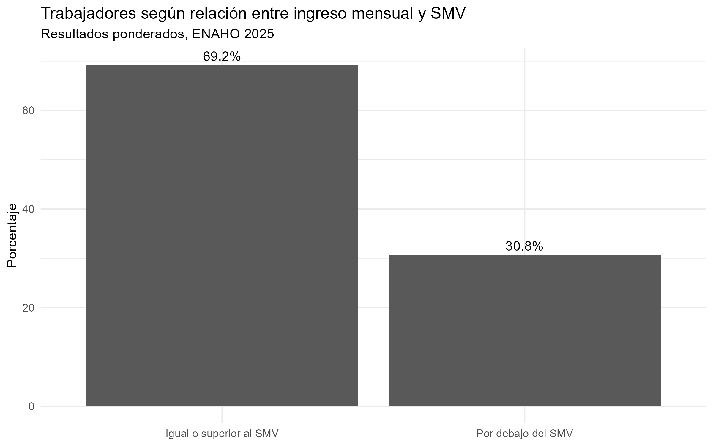
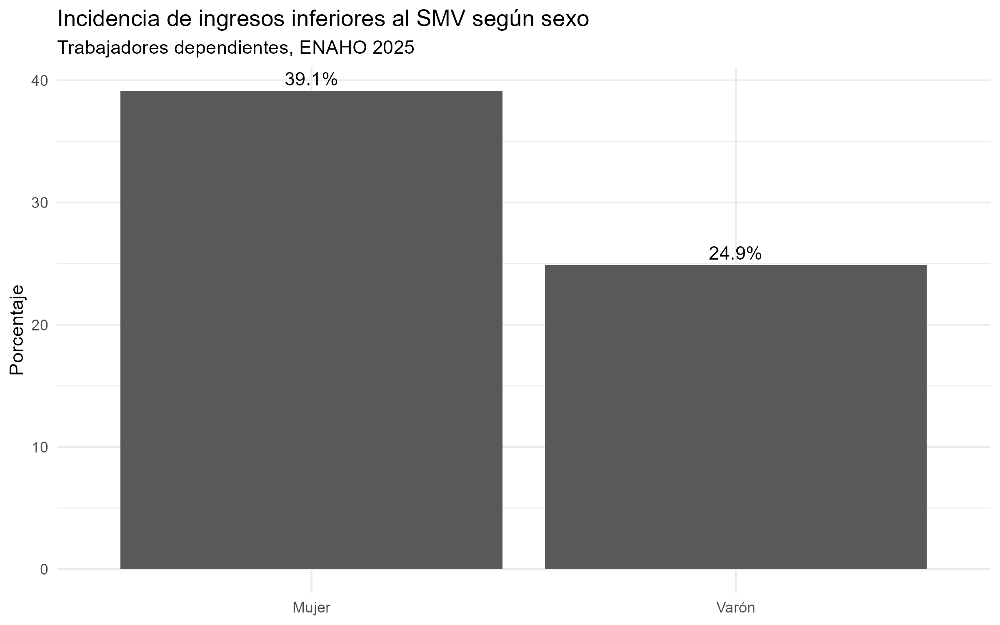
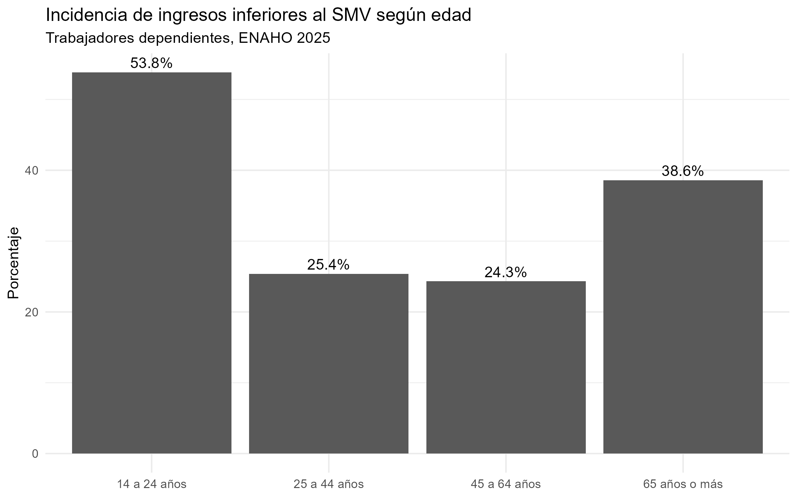

```{r setup, include=FALSE}
knitr::opts_chunk$set(
  echo = FALSE,
  warning = FALSE,
  message = FALSE
)

library(tidyverse)
```


# Introducción

El presente trabajo analiza la incidencia de ingresos laborales inferiores a la Remuneración Mínima Vital (SMV) entre los trabajadores dependientes en el Perú. Para ello se utiliza información de la Encuesta Nacional de Hogares (ENAHO) correspondiente al año 2025.

El análisis contempla las diferencias según sexo, edad, categoría ocupacional y contrato. Como indicador principal se construye una variable dummy que identifica a los trabajadores cuyo ingreso mensual se encuentra por debajo del SMV de S/ 1 130.

# Fuente de datos y metodología

## Fuente de información

Se utiliza el módulo 500 de Empleo e Ingresos de la ENAHO 2025, elaborada por el Instituto Nacional de Estadística e Informática (INEI). Este módulo contiene información correspondiente a personas de 14 años y más, incluyendo características de la ocupación principal y de los ingresos laborales.

## Población de análisis

La población analizada corresponde a trabajadores dependientes. Para su delimitación se utiliza la variable `P507`, referida a la categoría ocupacional, seleccionando las siguientes categorías:

- Empleado (`P507 = 3`).
- Obrero (`P507 = 4`).
- Trabajador del hogar (`P507 = 6`).

Para el análisis no hemos contemplado las categorías Empleador, Trabajador Independiente, Trabajador Familiar No Remunerado y Otro.

Luego de aplicar este criterio, la muestra de análisis está compuesta por 25 208 observaciones.

## Construcción de la variable dummy

Para comparar los ingresos laborales se construyó primero una medida de ingreso mensual a partir de las variables `P523`, que identifica la periodicidad del pago, y `P524A1`, que registra el monto recibido en el período correspondiente.

Los ingresos diarios fueron multiplicados por 30; los semanales, por 4.33; y los quincenales, por 2. Los ingresos declarados con periodicidad mensual se mantuvieron sin transformación.

A partir del ingreso mensual se construyó la variable dummy `bajo_smv`, definida de la siguiente manera:

- `1`: ingreso mensual inferior a S/ 1 130.
- `0`: ingreso mensual igual o superior a S/ 1 130.
- `NA`: casos sin información válida de ingreso.

Esta variable constituye el principal indicador de precariedad salarial utilizado en el trabajo. No pretende representar todas las dimensiones posibles de la precariedad laboral, sino específicamente la dimensión vinculada al nivel de ingreso.

## Variables de caracterización

La incidencia de la variable `bajo_smv` se analiza según sexo, grupos de edad, categoría ocupacional y tipo de contrato. Para las estimaciones poblacionales se utiliza el factor de expansión `FAC500A`.


# Resultados

## Caracterización de la muestra

La población de análisis está compuesta por 25 208 trabajadores dependientes, correspondientes a las categorías de empleados, obreros y trabajadores del hogar. A continuación se presenta la distribución de los casos de la muestra según sexo y grupos de edad.

```{r muestra-sexo}
tabla_muestra_sexo <- read_csv(
  "resultados/tabla_muestra_sexo.csv",
  show_col_types = FALSE
)

tabla_muestra_sexo %>%
  mutate(
    porcentaje = round(porcentaje, 1)
  ) %>%
  knitr::kable(
    col.names = c("Sexo", "Casos", "Porcentaje (%)"),
    align = c("l", "r", "r")
  )
```

```{r muestra-edad}
tabla_muestra_edad <- read_csv(
  "resultados/tabla_muestra_edad.csv",
  show_col_types = FALSE
)

tabla_muestra_edad %>%
  mutate(
    porcentaje = round(porcentaje, 1)
  ) %>%
  knitr::kable(
    col.names = c("Grupo de edad", "Casos", "Porcentaje (%)"),
    align = c("l", "r", "r")
  )
```


## Incidencia de ingresos inferiores al SMV

Para la población analizada se observa la siguiente distribución según la variable dummy de precariedad salarial.

```{r resultados-general}
tabla_general <- read_csv(
  "resultados/tabla_general.csv",
  show_col_types = FALSE
)

tabla_general %>%
  mutate(
    Situación = if_else(
      bajo_smv == 1,
      "Ingreso inferior al SMV",
      "Ingreso igual o superior al SMV"
    ),
    Porcentaje = round(porcentaje, 1)
  ) %>%
  select(Situación, Porcentaje) %>%
  knitr::kable(
    col.names = c("Situación", "Porcentaje (%)"),
    align = c("l", "r")
  )
```

Los resultados ponderados muestran que el **30,8 %** de los trabajadores dependientes considerados presenta un ingreso mensual inferior a S/ 1 130, mientras que el **69,2 %** registra un ingreso igual o superior a dicho valor.

```{r grafico-general, out.width="75%", fig.align="center"}

```


## Diferencias según sexo

La incidencia de ingresos inferiores al SMV presenta diferencias según el sexo de los trabajadores.

```{r resultados-sexo}
tabla_sexo <- read_csv(
  "resultados/tabla_sexo.csv",
  show_col_types = FALSE
)

tabla_sexo %>%
  filter(bajo_smv == 1) %>%
  mutate(
    Porcentaje = round(porcentaje, 1)
  ) %>%
  select(sexo, Porcentaje) %>%
  knitr::kable(
    col.names = c("Sexo", "Ingreso inferior al SMV (%)"),
    align = c("l", "r")
  )
```

Los resultados ponderados muestran que el **39,1 % de las mujeres** presenta ingresos mensuales inferiores al SMV, frente al **24,9 % de los varones**. En términos descriptivos, la incidencia de ingresos inferiores al umbral considerado es, por tanto, mayor entre las mujeres de la población analizada.

```{r grafico-sexo, out.width="75%", fig.align="center"}

```

## Diferencias según edad

También se observan diferencias importantes al considerar la edad de los trabajadores.

```{r resultados-edad}
tabla_edad <- read_csv(
  "resultados/tabla_edad.csv",
  show_col_types = FALSE
)

tabla_edad %>%
  filter(bajo_smv == 1) %>%
  mutate(
    Porcentaje = round(porcentaje, 1)
  ) %>%
  select(grupo_edad, Porcentaje) %>%
  knitr::kable(
    col.names = c("Grupo de edad", "Ingreso inferior al SMV (%)"),
    align = c("l", "r")
  )
```

El grupo de **14 a 24 años** presenta la mayor incidencia de ingresos inferiores al SMV, con **53,8 %**. Le siguen los trabajadores de **65 años o más**, con **38,6 %**. Entre los trabajadores de **25 a 44 años** la incidencia alcanza **25,4 %**, mientras que entre aquellos de **45 a 64 años** es de **24,3 %**.

Los resultados muestran, por tanto, una mayor incidencia de ingresos inferiores al umbral utilizado entre los trabajadores más jóvenes y, en segundo término, entre los de mayor edad.

```{r grafico-edad, out.width="75%", fig.align="center"}

```


## Diferencias según categoría ocupacional

La incidencia de ingresos inferiores al SMV también presenta diferencias según la categoría ocupacional de los trabajadores dependientes.

```{r resultados-categoria}
tabla_categoria <- read_csv(
  "resultados/tabla_categoria.csv",
  show_col_types = FALSE
)

tabla_categoria %>%
  filter(bajo_smv == 1) %>%
  mutate(
    Porcentaje = round(porcentaje, 1)
  ) %>%
  select(categoria_ocupacional, Porcentaje) %>%
  knitr::kable(
    col.names = c("Categoría ocupacional", "Ingreso inferior al SMV (%)"),
    align = c("l", "r")
  )
```

Los resultados ponderados muestran diferencias importantes entre las tres categorías analizadas. Entre los **empleados**, el **22,3 %** registra ingresos inferiores al SMV. La proporción aumenta a **37,3 %** entre los **obreros** y alcanza **61,3 %** entre los **trabajadores del hogar**.

En términos descriptivos, los trabajadores del hogar presentan la mayor incidencia de ingresos inferiores al umbral considerado, seguidos por los obreros y los empleados.

## Diferencias según situación contractual

Finalmente, se analiza la incidencia de ingresos inferiores al SMV según el tipo de contrato.

```{r resultados-contrato}
tabla_contrato <- read_csv(
  "resultados/tabla_contrato.csv",
  show_col_types = FALSE
)

tabla_contrato %>%
  filter(bajo_smv == 1) %>%
  mutate(
    Porcentaje = round(porcentaje, 1)
  ) %>%
  select(tipo_contrato, Porcentaje) %>%
  arrange(desc(Porcentaje)) %>%
  knitr::kable(
    col.names = c("Tipo de contrato", "Ingreso inferior al SMV (%)"),
    align = c("l", "r")
  )
```

Las diferencias según situación contractual son igualmente marcadas. Entre los trabajadores **sin contrato**, el **52,4 %** presenta ingresos inferiores al SMV. Una proporción similar se observa entre quienes se encuentran bajo **formación laboral o prácticas** (**51,8 %**). En el **período de prueba**, la incidencia alcanza **35,8 %**, mientras que entre quienes trabajan mediante **locación de servicios** es de **22,8 %**.

Las proporciones son menores entre los trabajadores con contrato a **plazo fijo** (**12,0 %**), con contrato **indefinido o permanente** (**5,2 %**) y bajo régimen **CAS** (**3,9 %**). Descriptivamente, los resultados muestran una asociación entre la situación contractual y la incidencia de ingresos inferiores al SMV.

# Conclusiones

El análisis de la ENAHO 2025 muestra que el 30,8 % de los trabajadores dependientes considerados registra un ingreso mensual inferior a la Remuneración Mínima Vital de S/ 1 130. Este resultado corresponde a estimaciones ponderadas mediante el factor de expansión de la encuesta.

La incidencia de ingresos inferiores al SMV no es simétrico entre la población analizada. Según sexo, alcanza el 39,1 % entre las mujeres y el 24,9 % entre los varones. Las diferencias también son importantes según edad: el grupo de 14 a 24 años presenta la mayor incidencia, con 53,8 %, seguido por los trabajadores de 65 años o más, con 38,6 %.

La categoría ocupacional y la situación contractual muestran igualmente diferencias relevantes. Los trabajadores del hogar presentan la mayor incidencia entre las categorías ocupacionales analizadas, con 61,3 %, frente al 37,3 % de los obreros y el 22,3 % de los empleados. Asimismo, el 52,4 % de los trabajadores sin contrato registra ingresos inferiores al SMV.

En conjunto, los resultados permiten identificar diferencias en la incidencia de ingresos inferiores al SMV. Particularmente, con la variable dummy construida se puede sintetizar esta dimensión salarial de la precariedad laboral y analizar su distribución según varias aristas.

Debe considerarse que el indicador utilizado aborda únicamente la dimensión salarial de la precariedad laboral. Por ello, los resultados no permiten identificar por sí solos todas las formas de precariedad ni establecer relaciones causales entre las características analizadas y los niveles de ingreso.

Se sugiere que esta precariedad puede ampliarse al considerar otras categorías como los Trabajadores Independientes.
